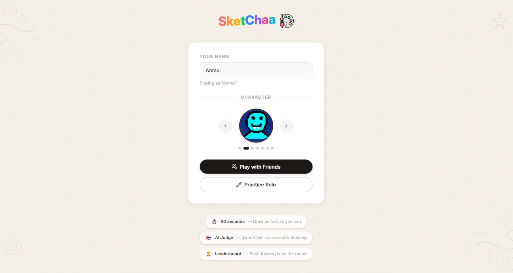
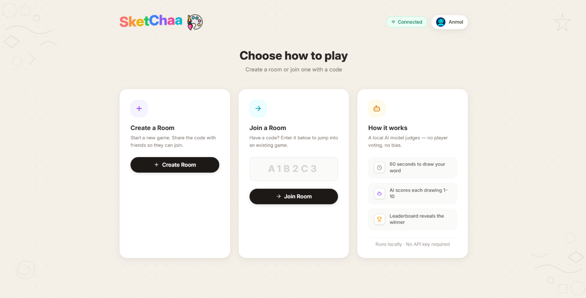
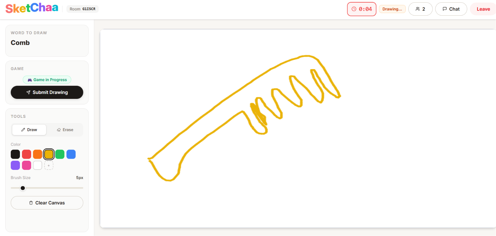
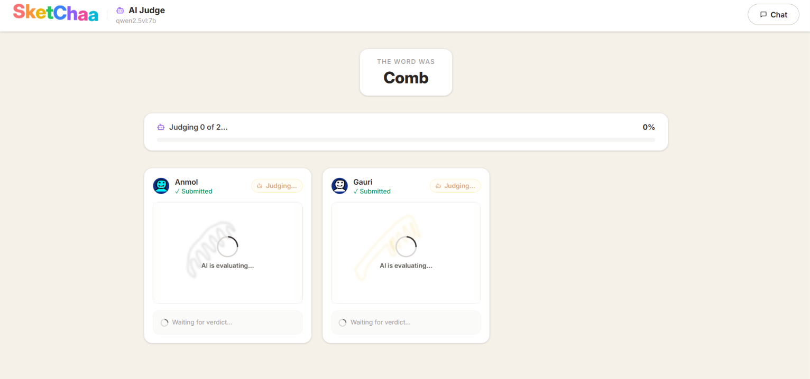
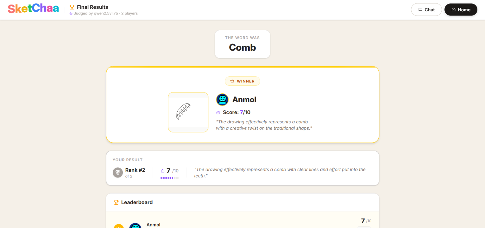
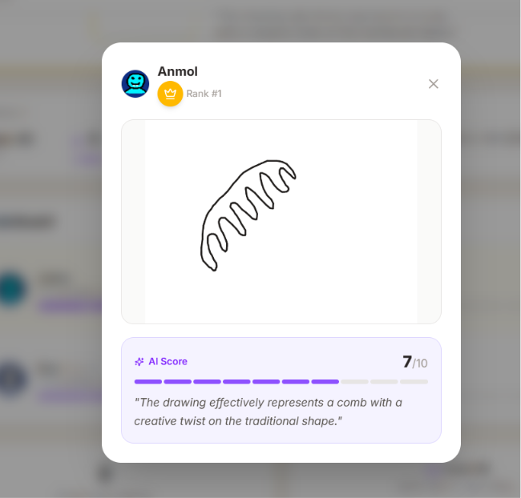
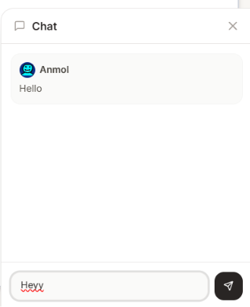

# 🎨 Sketchaa - Multiplayer Drawing & AI Judge Game

**Sketchaa** is a fast-paced multiplayer drawing game where creativity meets AI. Draw the given word and let a local AI model judge your artwork—no player voting required.

---

## Features

- Real-time multiplayer drawing canvas
- 60-second timed drawing rounds
- AI-powered judging using **Ollama** (`qwen2.5vl:7b`) running completely locally
- Live "AI Judging..." reveal as every drawing is evaluated
- AI-generated feedback for every submission
- Automatic leaderboard ranked by AI score
- In-game chat system
- Players cannot join once the game has started
- Room auto-expires after all players leave

---

## 🖼️ Project Preview

### Home Screen

<p align="center">
    
</p>

Choose your avatar, enter your name, and start playing.

---

### Game Lobby

<p align="center">
    
</p>

Create a room, invite friends using a room code, or join an existing game.

---

### Drawing Canvas

<p align="center">
    
</p>

Draw the given word using multiple colors and brush sizes before the timer expires.

---

### AI Judging

<p align="center">
    
</p>

Once all drawings are submitted, **Ollama** runs **Qwen2.5-VL** locally to evaluate every drawing in real time.

---

### Final Results

<p align="center">
    
</p>

The AI ranks every player based on the quality of their drawing and announces the winner.

---

### AI Feedback

<p align="center">
    
</p>

Every drawing receives a score along with a short explanation of what the AI recognized.

---

### In-game Chat

<p align="center">
    
</p>

Players can communicate throughout the game using the built-in real-time chat.

---

## 🚀 Getting Started

### Prerequisites

Install **Ollama** and download the **Qwen2.5-VL** vision model before starting the project.

### 1. Install Ollama

Download it from:

https://ollama.com/download

### 2. Pull the vision model

```bash
ollama pull qwen2.5vl:7b
```

> The model requires approximately **5 GB** of storage.

### 3. Verify Ollama is running

```
http://localhost:11434
```

---

### Clone the Repository

```bash
git clone https://github.com/hck-anmol/Sketchaa.git
cd Sketchaa
```

### Install Dependencies

```bash
# Server
cd server
npm install

# Client
cd ../client
npm install
```

### Run the Project

```bash
# Start the backend
node server.js

# Start the frontend
npm run dev
```

Client:

```
http://localhost:5173
```

Server:

```
http://localhost:5000
```

---

## ⚙️ Configuration

Create a `.env` file inside the `server` directory.

```env
PORT=5000
OLLAMA_URL=http://localhost:11434
OLLAMA_MODEL=qwen2.5vl:7b
```

| Variable | Default | Description |
|----------|---------|-------------|
| PORT | 5000 | Backend server port |
| OLLAMA_URL | http://localhost:11434 | Ollama server URL |
| OLLAMA_MODEL | qwen2.5vl:7b | Vision model used for judging |

---

## 🎮 Game Flow

1. Create or join a room.
2. The host starts the game.
3. Players draw the assigned word within 60 seconds.
4. Drawings are submitted automatically.
5. **Ollama** evaluates each drawing using **Qwen2.5-VL**.
6. AI scores and feedback are revealed live.
7. The leaderboard announces the winner.

---

## 🛠️ Tech Stack

| Layer | Technology |
|--------|------------|
| Frontend | React + Vite |
| Styling | Tailwind CSS |
| Backend | Node.js + Express |
| Real-time Communication | Socket.IO |
| AI Judge | Ollama + Qwen2.5-VL |
| Canvas | HTML5 Canvas API |

---

## 🔧 Troubleshooting

**AI judge is offline**

- Make sure Ollama is running.
- Run `ollama list` to verify `qwen2.5vl:7b` is installed.
- Ensure port `11434` is accessible.

**Model is slow**

- Use a machine with at least **16 GB RAM**.
- Alternatively, switch to `qwen2.5vl:3b` by changing `OLLAMA_MODEL`.

---

## 💡 Future Improvements

- Public matchmaking
- Spectator mode
- Additional Ollama vision models
- More drawing tools
- Mobile support

---

## 👨‍💻 Developer

Built with ❤️ by **Anmol Kumar**.